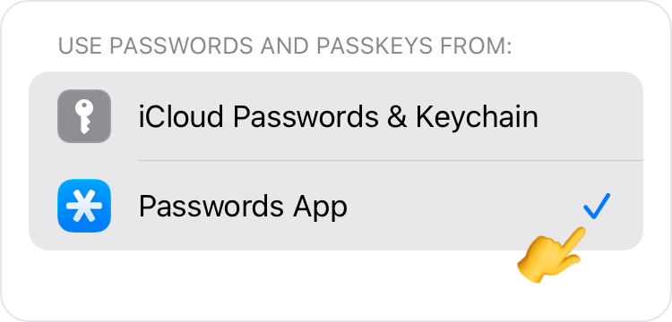

<!-- 
---
title: How to set up Passkeys App as a main passkeys app?
--- 
-->

## **How to set up Passkeys App as a main passkeys app?**

 

Starting with iOS 17, Apple allows choosing the main passkeys app from your device settings. Follow these simple steps to set up it.

 

*1. Go to **Settings** app.* 

*2. Find and Tap **Passwords**.* 

*3. Tap **Passwords Options**.* 

*4. Select **Passkeys App**.* 

 

 

`IMPORTANT`: Make sure to deselect **iCloud Passwords & Keychain** after selecting Passkeys App.

 

Still have a question?
[**Contact Us**](passkeys://contact?subject=How%20to%20set%20up%20Passkeys%20App%20as%20a%20main%20passkeys%20app%3F)