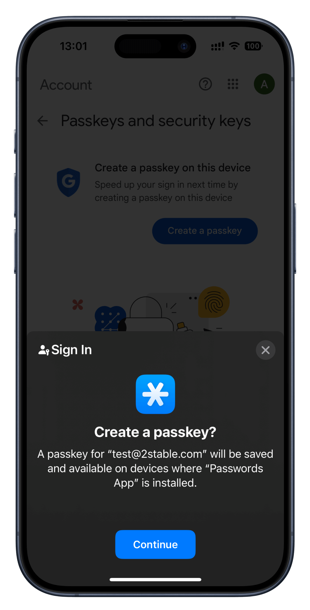
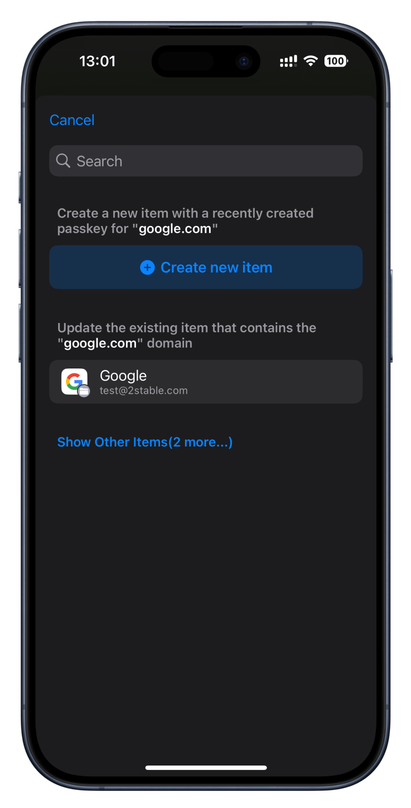
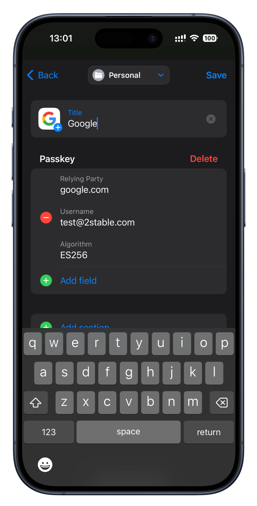
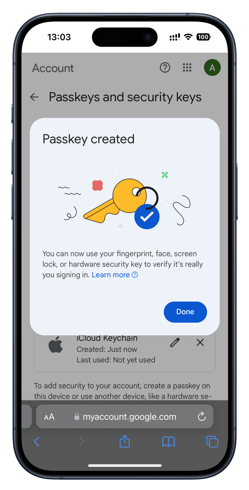

<!-- 
---
title: How to add a passkey?
--- 
-->

## **How to add a passkey?**

 

If you're looking to add a passkey to an existing account or create a new one, just follow these steps:

 

*1. Ensure **Password Manager by 2Stable** is set as your primary app for managing Passwords and Passkeys. [**Learn more...**](passwords://faq?question=0005)*

*2. Visit the website where you wish to use passkeys (e.g., **Google.com, PayPal.com**)..*

*3. Look for an option to set up Passkeys and tap **Continue**.*

*4. Choose whether to add the passkey to an existing account or create a new one.*

*5. Confirm and Save the Passkey*

*6. That's it! You're now ready to log in using your passkey.*

