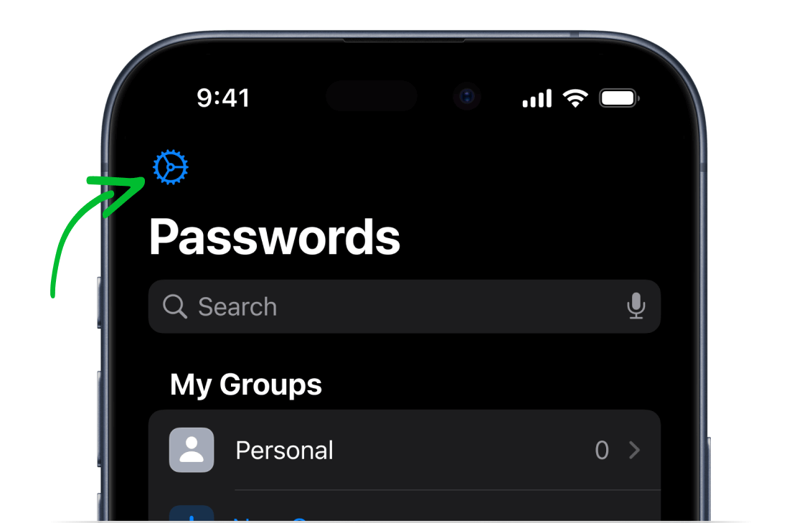
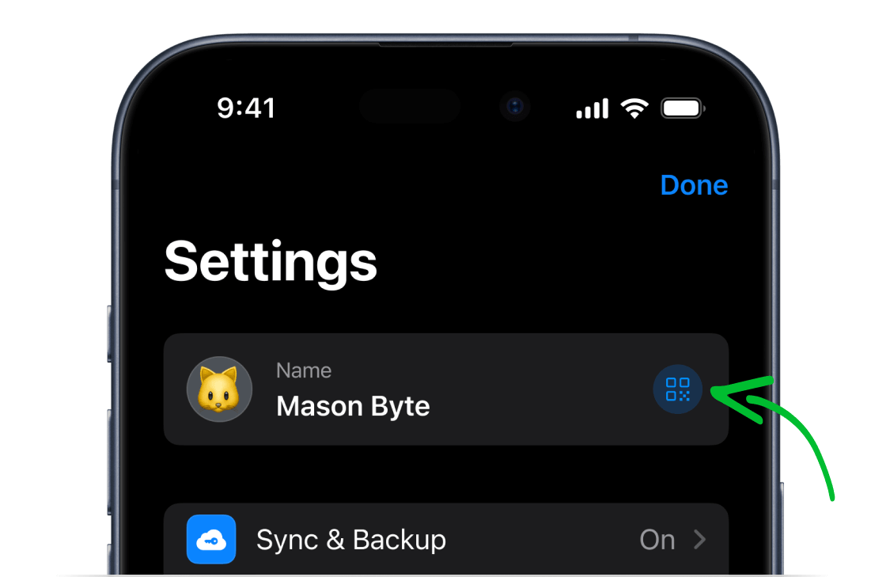
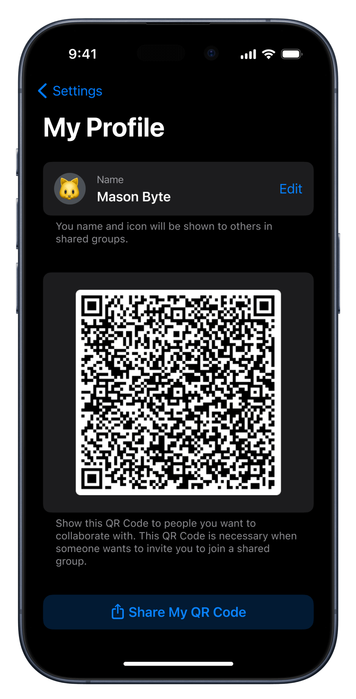

<!-- 
---
title: How to find your profile QR Code?
--- 
-->

## **How to find your profile QR Code?**

 

*1. Open Password Manager by 2Stable on your device.*

 

*2. Tap on **Settings** in the top-left corner.*

 

*3. Tap the **QR Code** icon displayed next to your name.*

 

*3. Share your QR Code with the **Group** administrator.*

