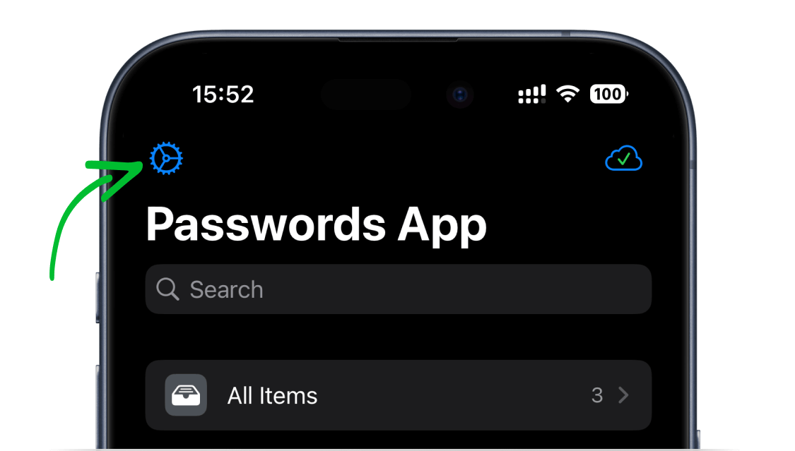
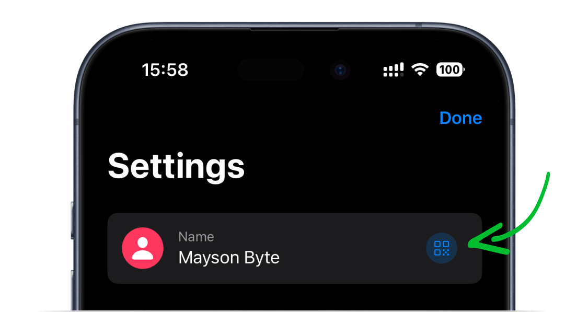
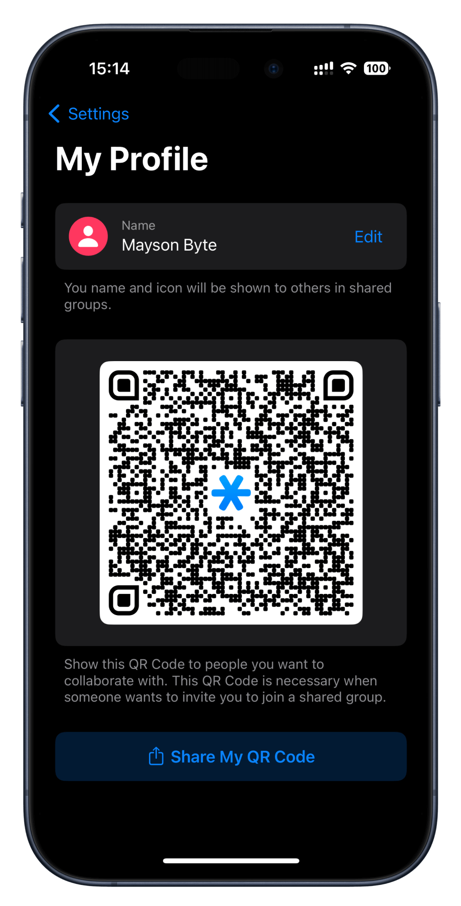

<!-- 
---
title: How to Find Your Profile QR Code?
--- 
-->

## **How to Find Your Profile QR Code?**

 

*1. Open Password Manager by 2Stable on your device.*

 

*2. Tap on "Settings" in the top-left corner*

 

*3. Press on the profile section.*

 

*3. Share your QR code with the "Shared Group" administrator.*

