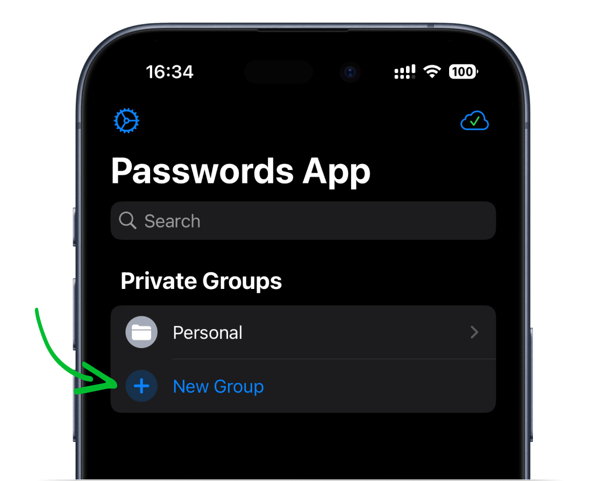
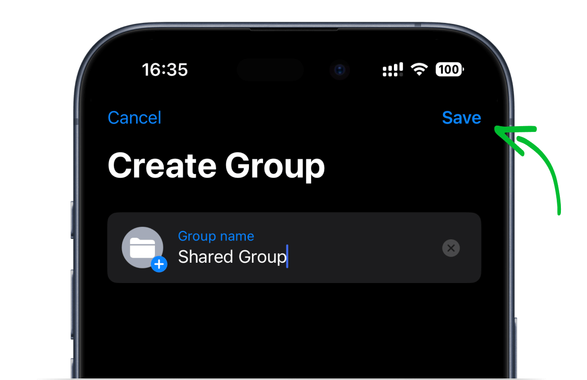
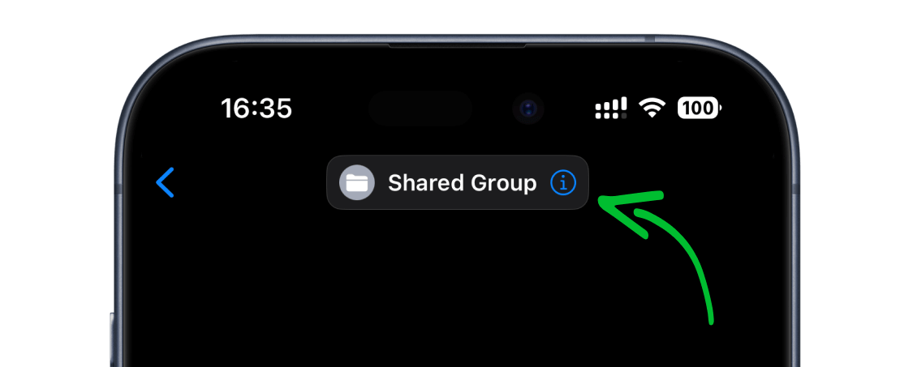
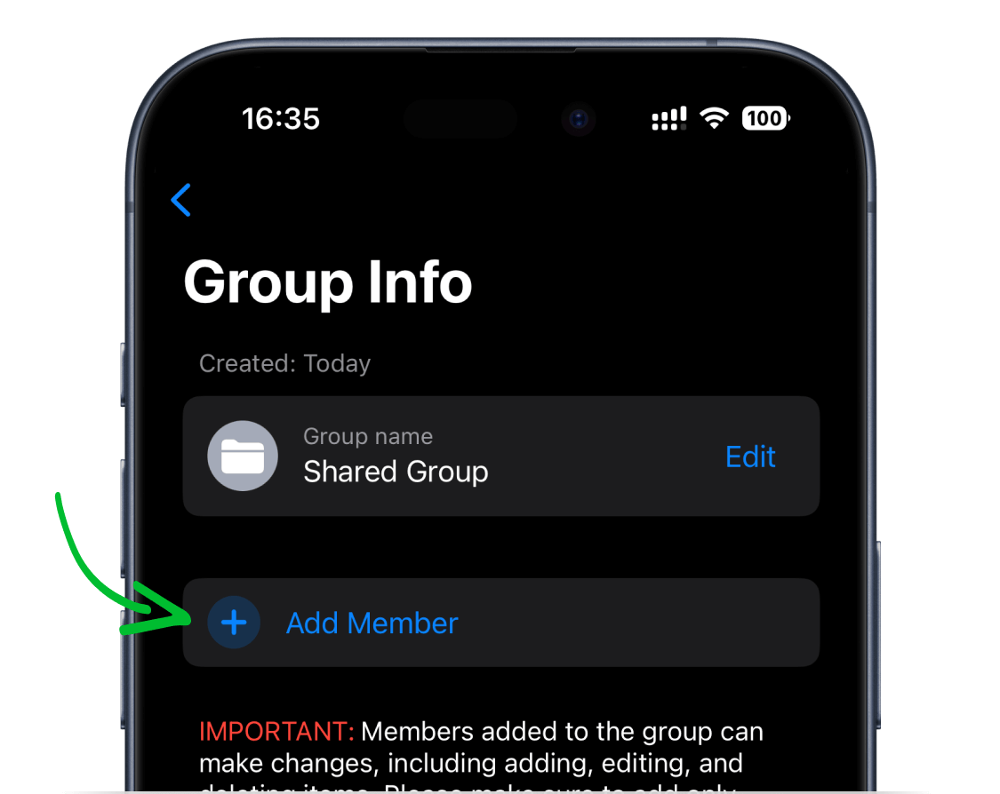
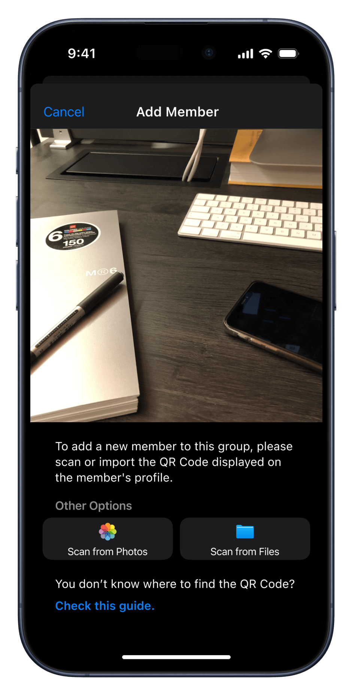

<!-- 
---
title: How to add a new member to a shared group?
--- 
-->

## **How to add a new member to a shared group?**

 

*1. Tap on **New Group**.*

 

*2. Choose a descriptive name for the group and tap the **Save** button. You can also customize the group icon by tapping the **plus** button.*

 

*2. Press the **More Info** icon next to the group details.*

 

*3. Tap **Add Member**.*

 

*4. Scan or import the QR Code of the member you wish to invite.*

 

`NOTE`: Shared Groups can include up to 100 people.