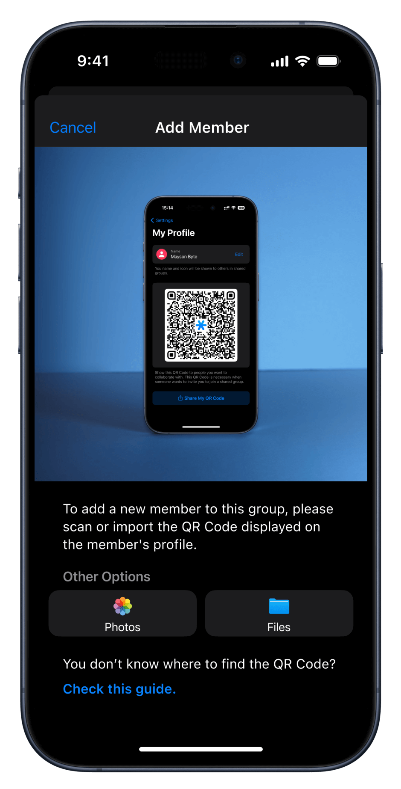

<!-- 
---
title: How to Add a New Member to a Shared Group?
--- 
-->

## **How to Add a New Member to a Shared Group?**

 

*1. Tap on "New Group".*

 

*2. Choose a descriptive name and tap on "Save" button.*

 

*2. Press the "More Info" icon next to the group details.*

 

*3. Select "Add Members".*

 

*4. Scan or import the QR code of the member you wish to invite.*

